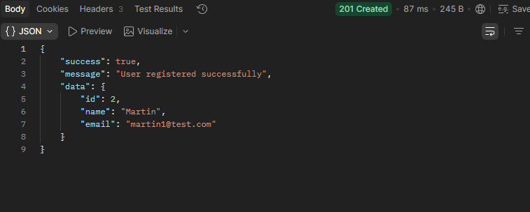
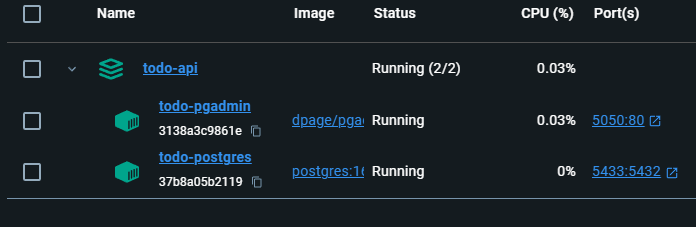
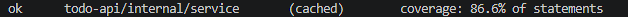

# Todo API

REST API Todo List menggunakan **Go**, **Gin**, **PostgreSQL**, **GORM**, **JWT Authentication**, **Swagger**, **Docker**, dan **Clean Architecture**.

---

## Badges


---

## Project Status

- Clean Architecture
- JWT Authentication
- User Registration and Login
- Protected User Profile
- Todo CRUD
- Pagination and Search
- Request Validation
- Swagger Documentation
- Docker Compose
- Unit Testing
- Service Coverage 86.6%
- GitHub Actions

---

## Features

- User registration
- User login
- JWT authentication
- Protected profile endpoint
- Create, read, update, and delete Todo
- Todo ownership validation
- Pagination
- Search by Todo title
- Request validation
- Swagger API documentation
- PostgreSQL database
- GORM Auto Migration
- Docker and pgAdmin
- Unit tests with mock repositories
- GitHub Actions CI

---

## Preview

### Swagger Documentation


### User Registration



### Docker Services



### Unit Test Coverage



---

## Tech Stack

- Go
- Gin
- GORM
- PostgreSQL
- JWT
- bcrypt
- Viper
- Swagger
- Docker
- Docker Compose
- pgAdmin
- GitHub Actions

---

## Project Structure

```text
go-rest-api-template/
├── .github/
│   └── workflows/
│       └── ci.yml
├── assets/
│   ├── coverage.png
│   ├── docker.png
│   ├── postman-register.png
│   └── swagger-home.png
├── cmd/
│   └── server/
│       └── main.go
├── config/
├── docs/
├── internal/
│   ├── database/
│   ├── domain/
│   ├── dto/
│   ├── handler/
│   ├── middleware/
│   ├── mocks/
│   ├── repository/
│   ├── routes/
│   ├── service/
│   └── utils/
├── migrations/
├── pkg/
├── scripts/
├── .env.example
├── .gitignore
├── docker-compose.yml
├── Dockerfile
├── go.mod
├── go.sum
├── LICENSE
├── Makefile
└── README.md
```

---

## Architecture

```text
HTTP Request
      │
      ▼
Gin Router
      │
      ▼
JWT Middleware
      │
      ▼
Handler
      │
      ▼
Service
      │
      ▼
Repository
      │
      ▼
PostgreSQL
```

---

## API Endpoints

### Authentication

| Method | Endpoint | Description | Authentication |
|---|---|---|---|
| POST | `/api/v1/auth/register` | Register user | No |
| POST | `/api/v1/auth/login` | Login user | No |
| GET | `/api/v1/auth/profile` | Get current user profile | Bearer Token |

### Todos

| Method | Endpoint | Description | Authentication |
|---|---|---|---|
| POST | `/api/v1/todos` | Create Todo | Bearer Token |
| GET | `/api/v1/todos` | Get Todo list | Bearer Token |
| GET | `/api/v1/todos/{id}` | Get Todo detail | Bearer Token |
| PUT | `/api/v1/todos/{id}` | Update Todo | Bearer Token |
| DELETE | `/api/v1/todos/{id}` | Delete Todo | Bearer Token |

Pagination and search example:

```http
GET /api/v1/todos?page=1&limit=10&search=golang
```

---

## Requirements

Pastikan aplikasi berikut sudah terpasang:

- Go
- Docker Desktop
- Git
- Postman

---

## Installation

Clone repository:

```bash
git clone https://github.com/Vincent1920/go-rest-api-template.git
cd go-rest-api-template
```

Install dependency:

```bash
go mod tidy
```

Copy environment example:

```bash
cp .env.example .env
```

Sesuaikan nilai database dan JWT secret di file `.env`.

---

## Run with Docker

Jalankan PostgreSQL dan pgAdmin:

```bash
docker compose up -d
```

Periksa status container:

```bash
docker compose ps
```

Service development:

```text
PostgreSQL : localhost:5433
pgAdmin    : http://localhost:5050
```

Menghentikan container:

```bash
docker compose stop
```

Menghapus container tanpa menghapus volume database:

```bash
docker compose down
```

---

## Run the API

Jalankan dari root project:

```bash
go run ./cmd/server
```

API berjalan di:

```text
http://localhost:8080
```

Health check:

```http
GET http://localhost:8080/
```

Expected response:

```json
{
  "message": "Todo API Running"
}
```

---

## Swagger Documentation

Swagger UI tersedia di:

```text
http://localhost:8080/swagger/index.html
```

Generate ulang dokumentasi Swagger:

```bash
swag init -g cmd/server/main.go --parseInternal
```

Untuk endpoint yang dilindungi, klik tombol **Authorize** dan masukkan JWT Bearer Token.

---

## Authentication Example

### Register

```http
POST http://localhost:8080/api/v1/auth/register
```

Request body:

```json
{
  "name": "Martin",
  "email": "martin@example.com",
  "password": "123456"
}
```

### Login

```http
POST http://localhost:8080/api/v1/auth/login
```

Request body:

```json
{
  "email": "martin@example.com",
  "password": "123456"
}
```

Gunakan token dari response login:

```http
Authorization: Bearer <token>
```

---

## Todo Example

### Create Todo

```http
POST http://localhost:8080/api/v1/todos
```

Request body:

```json
{
  "title": "Belajar Golang",
  "description": "Menyelesaikan Todo REST API",
  "status": "Pending"
}
```

Status yang tersedia:

```text
Pending
In Progress
Done
```

---

## Running Tests

Jalankan seluruh test:

```bash
go test ./...
```

Jalankan test service secara verbose:

```bash
go test ./internal/service -v
```

Cek coverage service:

```bash
go test ./internal/service -cover
```

Buat file coverage:

```bash
go test ./internal/service -coverprofile=coverage.out
```

Coverage service saat ini:

```text
86.6% of statements
```

---

## GitHub Actions

Workflow CI berada di:

```text
.github/workflows/ci.yml
```

Workflow otomatis menjalankan:

- Go formatting check
- Go Vet
- Unit tests
- Coverage generation
- Application build

Workflow berjalan pada:

- Push ke branch `main`
- Pull request ke branch `main`

---

## Postman

Endpoint dapat diuji menggunakan Postman.

Collection dapat ditempatkan pada:

```text
postman/TodoAPI.postman_collection.json
```

Gunakan JWT hasil login pada:

```text
Authorization → Bearer Token
```

---

## License

Project ini menggunakan [MIT License](LICENSE).

---

## Author

**Martin**

GitHub: `https://github.com/Vincent1920`